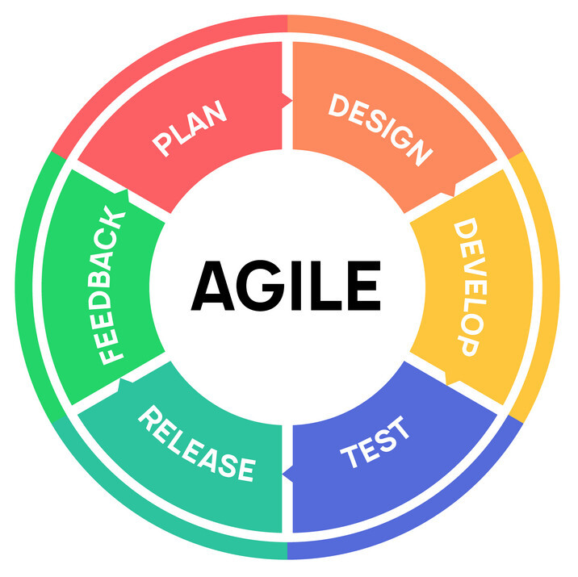

<h1 align="center">
  
</h1>

<h5 align="center">
  <code>
    <a href="https://www.linkedin.com/in/connoralbert/" title="LinkedIn Profile"> LinkedIn</a></code>
  <code><a href="https://connoralbert-portfolio.netlify.app/" title="Portfolio"> Portfolio</a></code>
</h5>

<h2 align="center">🔥 Languages & Frameworks & Tools & Abilities 🔥</h2>
 

 
  <code></code>
  <code></code>
  <code></code>
  <code></code>
  <code></code>
  <code></code>
  <code></code>
  <code></code>
  <code></code>
  <code></code>
  <code></code>
  <code></code>
  <code></code>
  <code></code>
  <code></code>
  <code></code>
  <code></code>

<h2 align="center">⚡ Stats ⚡</h2>
 

  

    
    
  

  
  

